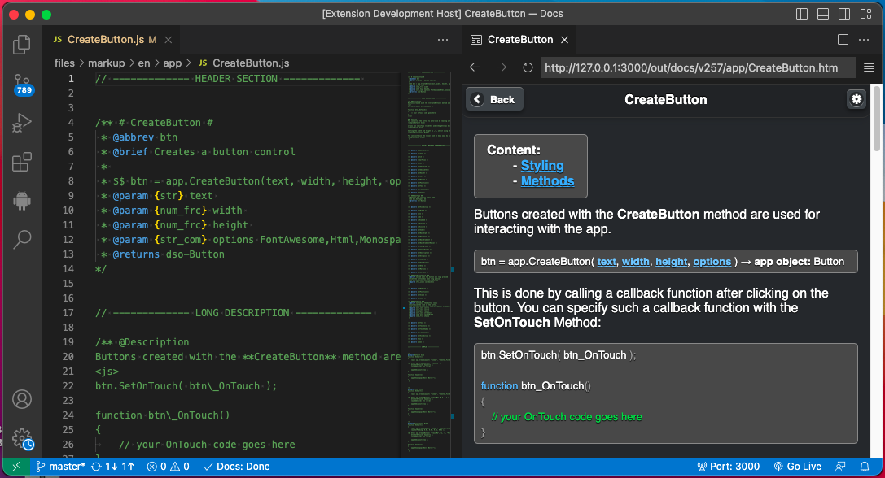
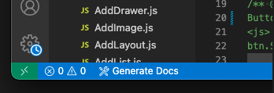
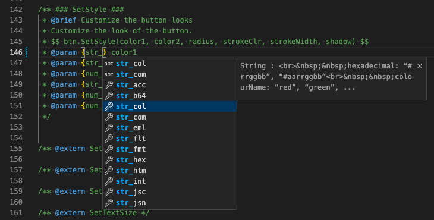

# DroidScript Docs

An extension to edit and view DroidScript Docs.

### Shortcuts:
- `alt+d` - Show & Select Command List
- `ctrl+alt+d` - Generate Docs

### How to start editing
1. Login to your GitHub account and fork the [DroidScript Docs](https://github.com/DroidScript/Docs) repository on Github.
2. Clone the forked repository in your local machine for you to edit the Docs locally using VS Code.
3. After cloning, open **Docs** in VS Code and this extension will automatically detect the folder as **DroidScript Docs** and append the **Generate Docs** button in the status bar of VS Code.

### Parameter Data Type Completion
DroidScript Docs has its own custom data types which you can see in the **js markup** files. Though it supports the common data types e.g. _`String`_, _`Number`_, _`Boolean`_, _`Object`_, _`Function`_, _`Array`_, etc., the custom docs data types has an addition description in it.

Examples:

| Data Type | Description |
| --- | --- |
| **`num_frc`** | Number: fraction (0..1) |
| **`str_col`** | String: hexadecimal: `“#rrggbb”`, `“#aarrggbb”` colourName: `“red”`, `“green”`, ... |
| **`str_com`** | String: comma `“,”` separated: |

Memorizing these custom data types is not practical so the extension offers word suggestions for them with their description. See image below.

### How to generate
- Click the **"Generate Docs"** button item in the status bar.

> After the generation, the rendered docs will be opened in a new live-server panel on the right.

If you are satisfied with the result of your changes to the Docs, you can commit and push your changes to your copy of the repo and then send a **Pull Request** to DroidScript Docs.

#### Authors
- **GineersLife:** Jumar Hamac - *hamacjumar@gmail.com*

#### Contributors:
- **Symbroson:** - alex-Symbroson@gmail.com
