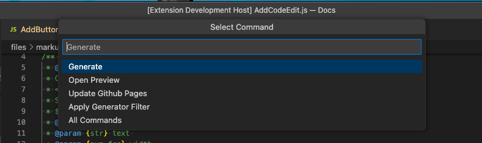

# DroidScript Docs

An extension to edit and view DroidScript Docs.

## Shortcuts:
- `alt+d` - Show & Select Command List
- `ctrl+alt+d` - Generate Docs
- `ctrl+alt+f` - Generate single file
- `alt+u` - Upload all Docs to DroidScript
- `ctrl+alt+u` - Upload single file to DroidScript

## How to start editing
1. Login to your GitHub account and fork the [DroidScript Docs](https://github.com/DroidScript/Docs) repository on Github.
2. Clone the forked repository in your local machine for you to edit the Docs locally using VS Code.
3. After cloning, open **Docs** in VS Code and this extension will automatically detect the folder as **DroidScript Docs** and append the **Generate Docs** button in the status bar of VS Code.

## Parameter Data Type Completion
DroidScript Docs has its own custom data types which you can see in the **js markup** files. Though it supports the common data types e.g. _`String`_, _`Number`_, _`Boolean`_, _`Object`_, _`Function`_, _`Array`_, etc., the custom docs data types has an addition description in it.

Examples:

| Data Type | Description |
| --- | --- |
| **`num_frc`** | Number: fraction (0..1) |
| **`str_col`** | String: hexadecimal: `“#rrggbb”`, `“#aarrggbb”` colourName: `“red”`, `“green”`, ... |
| **`str_com`** | String: comma `“,”` separated: |

Memorizing these custom data types is not practical so the extension offers word suggestions for them with their description. See image below.

## How to generate?

### Option 1 - Generate all scopes
- Use the `ctrl+alt+d`shortcut, or click the **`Generate Docs`** button item in the status bar and select the **`"Generate"`** option in the commands dropdown and select `"Open Docs Preview"` menu in the dropdown context menus.

### Option 2 - Generate specific file
You can simply use the `ctrl+alt+f` shortcut, or **Right-Click** on any markup (`".js"`) file and markdown (`".md"`) file within the scopes in the `"markup/<LANG>"` folder.

You can also **Right-Click** on the editor tab name.

## Preview

After the generation, the rendered docs will be opened in a new live-server panel on the right. If there is no live preview being shown, click the **`Generate Docs`** button item in the status bar and select `"Open Preview"` command in the commands dropdown.

### Upload to DroidScript

You can also update the Docs in DS directly, by either using the `ctrl+alt+u` shortcut on your editing file, or `alt+u` to upload all of them at once (according to your currently used filter settings).\
You can also upload all docs from `All Commands` in the status bar menu.\
**Note:** To upload your files to DroidScript you need to start the **DS WiFi Server** in the app. You are being prompted to enter the IP in VSCode. If there is a dsconfig.json file present in your user home directory (from the vscode-droidscript-code extension) it is considered as input as well.

If you are satisfied with the result of your changes to the Docs, you can commit and push your changes to your copy of the repo and then send a **Pull Request** to DroidScript Docs.

## Live Preview Flickering Issue

If you notice flickering on the live preview when you type on the editor or when you save a file, it is due to live preview extension settings that will auto update when there are changes in the editor files. You can turn it off in VS Code by going to

**`"Settings > User > Extensions > Live Preview > Live Preview: Auto Refresh Preview"`**

And then select **`"Never"`**.

### Authors
- **GineersLife:** Jumar Hamac - *hamacjumar@gmail.com*

#### Contributors:
- **Symbroson:** - alex-Symbroson@gmail.com
